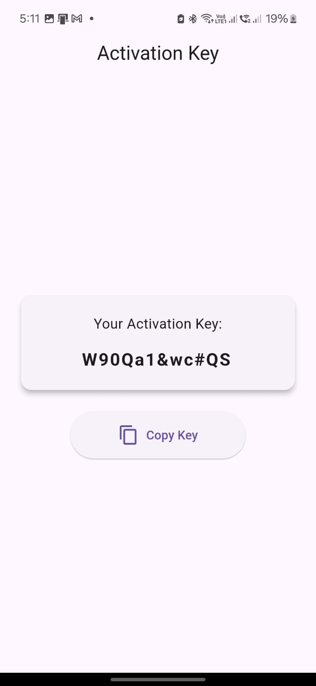

# Authorization App

A Flutter application for secure key generation and management with advanced encryption features.

## App Preview

<div align="center">
  
  <p><em>Key Generation</em></p>
</div>

## Features

- Secure key generation and storage
- AES encryption implementation
- Automatic backup system
- Permission handling for different Android versions
- Device-specific security measures
- Persistent storage management
- Automatic key recovery system

## Technical Requirements

### Dependencies

```yaml
dependencies:
  flutter:
    sdk: flutter
  encrypt: ^5.0.3
  device_info_plus: ^9.1.2
  path_provider: ^2.1.2
  permission_handler: ^11.3.0
  crypto: ^3.0.3
```

### System Requirements

- Flutter SDK: 3.0.0 or higher
- Dart SDK: 2.17.0 or higher
- Android: API level 21 (Android 5.0) or higher
- iOS: iOS 11.0 or higher

## Installation

1. Clone the repository:

```bash
git clone https://github.com/MAboElFottouh/Generator_Key.git
```

2. Navigate to project directory:

```bash
cd authorization
```

3. Install dependencies:

```bash
flutter pub get
```

4. Run the app:

```bash
flutter run
```

## Project Structure

```

## Security Features

- AES-256 encryption for key storage
- Secure random key generation
- SHA-256 hashing for verification
- Automatic backup system
- File integrity checking
- Permission-based security
- Device-specific encryption

## Permissions

The app requires the following permissions based on Android version:

- Android < 13:
  - `WRITE_EXTERNAL_STORAGE`
  - `READ_EXTERNAL_STORAGE`

- Android 13:
  - `READ_MEDIA_IMAGES`
  - `READ_EXTERNAL_STORAGE`

- Android 14+:
  - `MANAGE_EXTERNAL_STORAGE`

## Key Features Implementation

### Key Generation
- 12-character length
- Includes uppercase and lowercase letters
- Contains numbers and special characters
- Cryptographically secure random generation

### Storage Security
- Encrypted storage using AES
- Automatic backup creation
- Regular integrity checks
- Recovery system for corrupted files

### User Interface
- Clean and intuitive design
- Copy to clipboard functionality
- Error handling with user-friendly messages
- Loading states and progress indicators

## Error Handling

The app implements comprehensive error handling for:
- Permission denials
- Storage issues
- Encryption/decryption failures
- File system errors
- Version compatibility issues

## Contributing

1. Fork the repository
2. Create your feature branch (`git checkout -b feature/AmazingFeature`)
3. Commit your changes (`git commit -m 'Add some AmazingFeature'`)
4. Push to the branch (`git push origin feature/AmazingFeature`)
5. Open a Pull Request

## License

This project is licensed under the MIT License - see the [LICENSE](LICENSE) file for details.

## Support

For support, please open an issue in the GitHub repository or contact the development team.

## Acknowledgments

- Flutter team for the amazing framework
- Contributors and maintainers of used packages
- The open-source community

## Version History

- 1.0.0
  - Initial release
  - Basic key generation and storage
  - Permission handling
  - Encryption implementation

```
